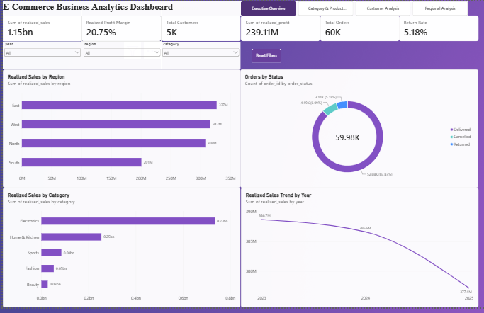
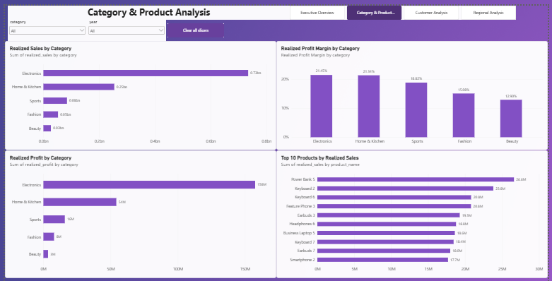
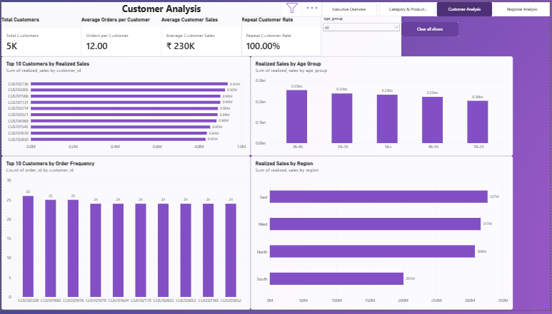
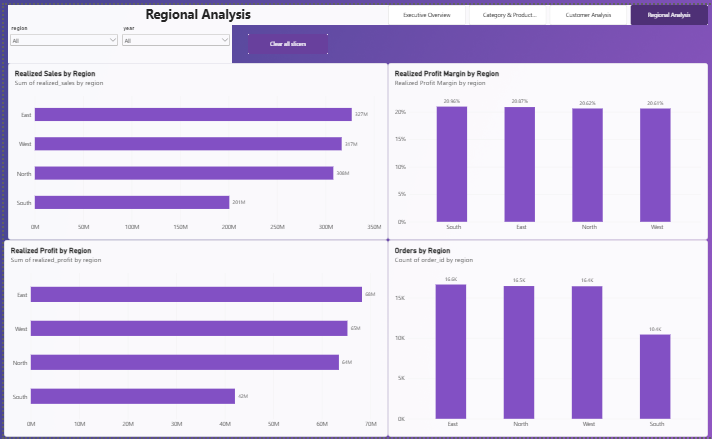

# E-Commerce Business Analytics

A portfolio-grade end-to-end **E-Commerce Business Analytics** project built with **Python, SQL/SQLite, and Power BI**.

The project demonstrates a complete analytics workflow: synthetic data generation, data-quality assessment, cleaning, validation, business metric engineering, SQL analysis, and an interactive Power BI dashboard.

## 📊 Project Overview

This project analyzes an e-commerce business across **2023–2025** to answer questions around:

- Sales and profitability
- Orders and customer activity
- Delivery, return, and cancellation performance
- Category and product performance
- Regional performance
- Customer value and order frequency
- Year-over-year business trends

The final solution combines Python for data preparation and analysis, SQLite for SQL-based business analysis, and Power BI for interactive reporting.

## 🎯 Business Objectives

The analysis was designed to help a business:

1. Monitor overall sales, profit, orders, and customer KPIs.
2. Understand realized revenue and profitability after order outcomes.
3. Identify high-performing and underperforming product categories.
4. Compare business performance across regions.
5. Understand customer purchasing behavior and value.
6. Track delivery, return, and cancellation rates.
7. Identify trends and opportunities for business improvement.

## 🗂️ Dataset

The project uses a synthetic e-commerce dataset containing:

- **Customers**
- **Products**
- **Orders**

The cleaned master dataset contains:

- **59,980 order records**
- **5,000 unique customers**
- **336 products**
- **5 categories**
- **20 cities**
- Date coverage: **January 2023 – December 2025**

> The dataset is synthetic and was generated specifically for this portfolio project. It should not be interpreted as real company data.

## 🧹 Data Preparation & Quality

The Python pipeline intentionally introduces data-quality issues into the raw data so the project demonstrates realistic analytics workflow practices.

### Data-quality workflow

1. Generate raw customer, product, and order data.
2. Inspect the raw datasets.
3. Identify missing values and duplicate records.
4. Clean and standardize the datasets.
5. Validate customer, product, and order relationships.
6. Build a consolidated `sales_master.csv`.
7. Validate the final master dataset before analysis.

### Cleaning results

| Dataset | Raw | Cleaned |
|---|---:|---:|
| Customers | 5,020 | 5,000 |
| Orders | 60,050 | 59,980 |
| Products | 336 | 336 |

The final master dataset passed the project's validation checks, including duplicate order-ID, missing-value, referential-integrity, and order-outcome consistency checks.

## 🧮 Business Metrics

The master dataset contains engineered business metrics such as:

- `gross_sales`
- `discount_amount`
- `net_sales`
- `product_cost`
- `profit_before_shipping`
- `profit`
- `profit_margin`
- `realized_sales`
- `realized_profit`
- `is_delivered`
- `is_returned`
- `is_cancelled`

Time dimensions include:

- Year
- Month
- Month name
- Quarter
- Year-month

Customer analysis also includes an `age_group` dimension.

## 📌 Key Business KPIs

| KPI | Result |
|---|---:|
| Total Orders | 59,980 |
| Total Customers | 5,000 |
| Total Products | 336 |
| Gross Sales | ₹1.501B |
| Net Sales | ₹1.315B |
| Realized Sales | ₹1.152B |
| Realized Profit | ₹239.11M |
| Realized Profit Margin | 20.75% |
| Average Order Value | ₹19,214 |
| Delivery Rate | 87.83% |
| Return Rate | 5.18% |
| Cancellation Rate | 6.99% |
| Orders per Customer | 12.00 |

## 💡 Key Business Insights

### 1. Electronics is the dominant revenue category

Electronics generated approximately **63.7% of realized sales**, making it the largest contributor to overall business revenue.

### 2. Profitability is relatively stable across the three years

Realized profit margin remained around **20–21%** during 2023–2025, although realized sales and profit declined moderately in 2025.

### 3. East is the largest regional contributor

The East region generated the highest realized sales share at approximately **28.4%**, followed closely by West and North.

### 4. Delivery performance is strong, but order losses remain important

The delivery rate is **87.83%**, while returns account for **5.18%** and cancellations for **6.99%** of orders. These non-delivered orders represent areas where operational improvements can potentially recover revenue.

### 5. Customer activity is high in the synthetic dataset

The average is **12 orders per customer**, and the dataset's customer segmentation identifies a large repeat-customer base.

> Customer segmentation results should be interpreted within the context of the synthetic dataset and its generation logic.

## 🏆 Category Performance

Realized-sales contribution:

| Category | Realized Sales Share | Profit Margin |
|---|---:|---:|
| Electronics | 63.72% | 21.45% |
| Home & Kitchen | 22.05% | 21.34% |
| Sports | 7.35% | 18.82% |
| Fashion | 4.55% | 15.08% |
| Beauty | 2.33% | 12.90% |

Electronics is both the largest sales contributor and one of the strongest-margin categories.

## 🌍 Regional Performance

| Region | Realized Sales Share | Profit Margin |
|---|---:|---:|
| East | 28.38% | 20.87% |
| West | 27.48% | 20.61% |
| North | 26.73% | 20.62% |
| South | 17.42% | 20.96% |

The regional analysis shows a relatively balanced margin profile, while East leads in realized-sales contribution.

## 🛒 Electronics Deep Dive

The project includes a dedicated electronics analysis covering:

- Electronics performance by year
- Electronics subcategory performance
- Product-level sales and profit
- Identification of profitable and loss-making products

Electronics subcategories include:

- Accessories
- Audio
- Laptop
- Mobile

The analysis highlights that strong sales volume does not automatically guarantee strong profitability, making product-level margin analysis important for decision-making.

## 🗄️ SQL Analysis

The project uses **SQLite** to demonstrate SQL-based business analysis.

Database:

```text
data/ecommerce.db
```

Tables:

```text
customers
products
orders
```

The SQL analysis includes queries for:

1. Total orders
2. Total customers
3. Total products
4. Orders by status
5. Sales by payment method
6. Orders by region
7. Sales by region
8. Orders by year
9. Sales by year
10. Top products
11. Sales by category
12. Sales by category and year
13. Top customers
14. Average order value
15. Average quantity per order
16. Monthly sales
17. Customer order frequency
18. Product performance

Main SQL file:

```text
sql/business_analysis.sql
```

## 📊 Power BI Dashboard

The Power BI dashboard is organized into four analytical pages:

1. Executive Overview
2. Category & Product Analysis
3. Customer Analysis
4. Regional Analysis

### Executive Overview



Provides a management-level view of:

- Realized Sales
- Realized Profit
- Profit Margin
- Total Orders
- Total Customers
- Return Rate
- Yearly sales trend
- Category performance
- Regional performance
- Order status distribution

### Category & Product Analysis



Provides:

- Sales by category
- Profit by category
- Profit margin by category
- Top 10 products by realized sales
- Category and year filtering

### Customer Analysis



Provides:

- Top customers by realized sales
- Top customers by order frequency
- Sales by age group
- Sales by region
- Customer KPIs
- Age-group filtering

### Regional Analysis



Provides:

- Sales by region
- Profit by region
- Profit margin by region
- Orders by region
- Region and year filtering

The report also includes slicers, reset-filter controls, page navigation, KPI cards, and interactive filtering.

Power BI file:

```text
powerbi/ECommerce_Business_Analytics.pbix
```

## 🛠️ Technologies Used

- **Python 3**
- **Pandas**
- **NumPy**
- **SQLite**
- **SQL**
- **Power BI Desktop**
- **DAX**
- **Git / GitHub**

## 📁 Project Structure

```text
ecommerce-business-analytics
│
├── data
│   ├── cleaned
│   └── raw
│
├── docs
│   ├── business_requirements.md
│   └── data_dictionary.md
│
├── powerbi
│   └── ECommerce_Business_Analytics.pbix
│
├── python
│   ├── build_master_dataset.py
│   ├── category_region_analysis.py
│   ├── category_year_analysis.py
│   ├── check_product_mapping.py
│   ├── clean_data.py
│   ├── customer_analysis.py
│   ├── data_quality_check.py
│   ├── electronics_analysis.py
│   ├── generate_data.py
│   ├── inspect_data.py
│   ├── kpi_analysis.py
│   ├── load_sqlite.py
│   ├── validate_clean_data.py
│   ├── validate_master_dataset.py
│   ├── verify_sqlite.py
│   └── yearly_analysis.py
│
├── reports
│
├── screenshots
│   ├── executive-overview.PNG
│   ├── category-product-analysis.PNG
│   ├── customer-analysis.PNG
│   └── regional-analysis.PNG
│
├── sql
│   └── business_analysis.sql
│
├── .gitignore
├── LICENSE
├── requirements.txt
└── README.md
```

## ▶️ How to Run the Project

### 1. Clone the repository

```bash
git clone https://github.com/swadhinbgp-sketch/ecommerce-business-analytics.git
cd ecommerce-business-analytics
```

### 2. Create and activate a virtual environment

```bash
python -m venv venv
venv\Scripts\activate
```

### 3. Install dependencies

```bash
pip install -r requirements.txt
```

### 4. Generate the raw datasets

```bash
python python/generate_data.py
```

### 5. Inspect and check data quality

```bash
python python/inspect_data.py
python python/data_quality_check.py
```

### 6. Clean and validate the data

```bash
python python/clean_data.py
python python/validate_clean_data.py
```

### 7. Build and validate the master dataset

```bash
python python/build_master_dataset.py
python python/validate_master_dataset.py
```

### 8. Run Python analysis

```bash
python python/kpi_analysis.py
python python/yearly_analysis.py
python python/category_region_analysis.py
python python/category_year_analysis.py
python python/customer_analysis.py
python python/electronics_analysis.py
```

### 9. Build and verify the SQLite database

```bash
python python/load_sqlite.py
python python/verify_sqlite.py
```

### 10. Run the SQL analysis

The SQL queries are stored in:

```text
sql/business_analysis.sql
```

The SQLite database is:

```text
data/ecommerce.db
```

### 11. Open the Power BI dashboard

Open:

```text
powerbi/ECommerce_Business_Analytics.pbix
```

If you regenerate the data, refresh the Power BI dataset before reviewing the dashboard.

## 🎯 Business Recommendations

Based on the analysis, a business could consider:

1. **Protect and expand Electronics performance** because it is the largest revenue contributor.
2. **Investigate cancellation and return drivers** to reduce lost sales.
3. **Review low-margin products** and evaluate pricing, discounts, sourcing, and shipping costs.
4. **Strengthen regional strategies** in the South region, which has lower sales contribution despite a competitive margin.
5. **Use customer segmentation** to target high-value and repeat customers with personalized offers.
6. **Monitor yearly sales trends** closely because 2025 shows a moderate decline compared with 2023.

## 📚 What This Project Demonstrates

This project demonstrates practical skills in:

- Data generation
- Data cleaning
- Data-quality analysis
- Data validation
- Feature engineering
- KPI development
- Exploratory business analysis
- SQL querying
- SQLite database management
- DAX measures
- Power BI dashboard development
- Business insight generation
- Data storytelling
- Git and GitHub version control

## 👤 Author

**Swadhin Kumar**

Aspiring **Data Analyst / Python Developer**

Skills demonstrated in this project:

`Python` · `Pandas` · `SQL` · `SQLite` · `Power BI` · `DAX` · `Data Analysis` · `Data Visualization`

---

⭐ If you find this project useful, consider giving the repository a star.